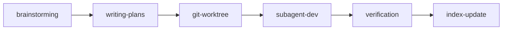

<!-- AUTO-GENERATED by scripts/generate-pipeline-docs.mjs — DO NOT EDIT -->

# 流水线定义（core/pipeline.md）

> Schema 定义：[`config/pipeline.schema.json`](../config/pipeline.schema.json)

## 功能级状态机

每个功能（`specs/<date+feature>/`）独立跟踪以下 8 个状态：

| 状态 | 对应 Step | 说明 |
|------|----------|------|
| `brainstorming` | Step 1 | 需求头脑风暴，探索 2-3 种实现方案 |
| `planning` | Step 2 | 按项目架构分层拆解 task |
| `approved` | — | 用户已确认计划，等待执行（检查点状态） |
| `git-worktree` | Step 3 | 创建隔离分支 |
| `executing` | Step 4 | 派发 subagent 编码，运行测试 |
| `verification` | Step 5 | 完成前验证（Spec覆盖、类型一致性、编译测试） |
| `synced` | Step 6 | 工程索引同步，功能开发完成 |
| `failed` | — | 流水线失败（任意阶段） |

```mermaid
stateDiagram-v2
    [*] --> brainstorming
    brainstorming --> planning : 用户确认 spec.md
    brainstorming --> failed : brainstorming 失败
    planning --> approved : 用户确认 plan.md
    planning --> failed : planning 失败
    approved --> git-worktree : 用户执行 loom-execute-plan
    approved --> failed : 执行前检查失败
    git-worktree --> executing : worktree 创建成功，触发 subagent
    git-worktree --> failed : worktree 创建失败
    executing --> verification : 所有 task 完成，进入验证
    executing --> failed : 测试失败或 BLOCKED 状态
    verification --> synced : 验证通过
    verification --> executing : BLOCKER 派回 implementer 修复
    verification --> failed : 验证发现 Critical 偏差
    failed --> brainstorming : 从头重新开始
    failed --> executing : 修复后重试执行
    failed --> verification : 修复后重试验证
```

## 6 步流水线

loom 框架的核心是 6 步流水线，定义了从需求到代码交付的完整执行流程。

```
brainstorming → writing-plans → git-worktree → subagent-dev → verification → index-update
```



### 流水线阶段

| Step | 阶段 | 说明 | 输出 |
|------|------|------|------|
| 1 | brainstorming | 需求头脑风暴，探索 2-3 种实现方案 | `specs/<date+feature>/spec.md` |
| 2 | writing-plans | 按项目架构分层拆解 task | `specs/<date+feature>/plan.md` |
| 3 | git-worktree | 创建隔离分支 | feature 分支 |
| 4 | subagent-dev | 派发 subagent 编码，运行测试 | 源码 + 测试报告 |
| 5 | verification | 完成前验证（Spec覆盖、类型一致性、编译测试） | 验证报告 |
| 6 | index-update | 工程索引同步，功能开发完成 | ENGINEERING-INDEX.md |

### 阶段串联规则

```
brainstorming 完成 → 等待用户确认 → writing-plans
writing-plans 完成 → 等待用户确认 → git-worktree
git-worktree 完成 → 触发 subagent-dev
subagent-dev 完成 → 触发 verification
verification 通过 → 触发 index-update
verification 未通过 → 修复后重新验证
index-update 完成 → 通知可以提交
```

**严令禁止跳过任何步骤。每个步骤完成后必须显式触发下一步。**

### 状态横幅规范

每个阶段开始和结束时必须输出状态横幅，格式：

```
━━━━━━━━━━━━━━━━━━━━━━━━━━━━━━━━━━━━━━━━
 pipeline [<进度条>] Step N/6 — <阶段名称> (<skill名>)
 skill:   <skill名>
 功能:    <功能名>
 status:  ▶ 开始执行 | ✅ 完成 | ❌ 失败
 下一步:  → Step N+1: <下一阶段>
━━━━━━━━━━━━━━━━━━━━━━━━━━━━━━━━━━━━━━━━
```

进度条规则：6 格，已完成的步骤填 ■，未到达的填 □。当前步骤通过 Step N/6 标识，状态通过 status 行显示（▶ 进行中 / ✅ 完成 / ❌ 失败）。

### 前置条件检查

每个阶段开始前必须检查前置条件：

| 阶段 | 前置条件 |
|------|---------|
| brainstorming | 用户提供需求描述 |
| writing-plans | spec.md 存在且用户已确认 |
| git-worktree | plan.md 存在 + 工作目录干净或可创建 worktree |
| subagent-dev | plan.md 存在 + worktree 已创建 |
| verification | 所有测试通过 + 编译通过 |
| index-update | 验证通过 + 所有测试通过 |

前置条件未满足时，必须停止并提示用户。
