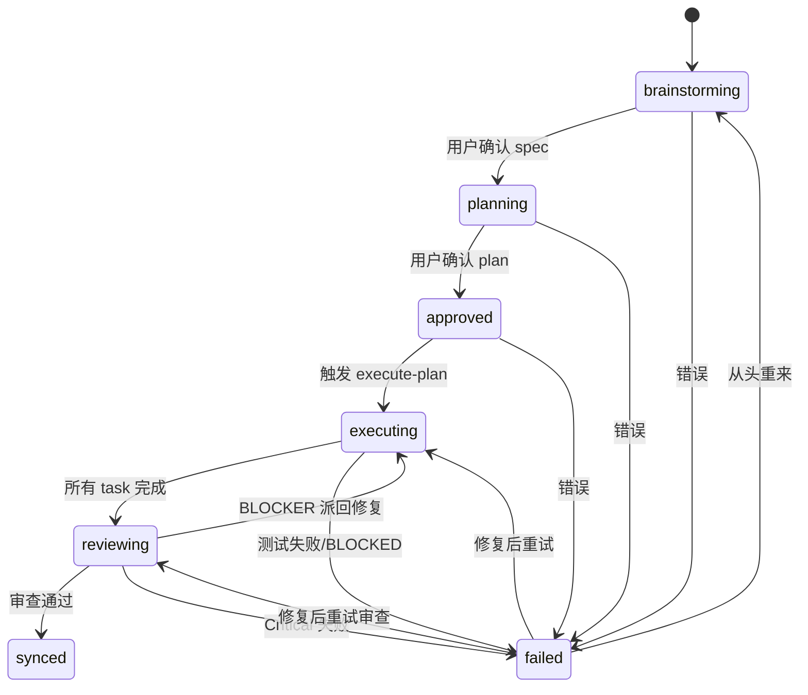
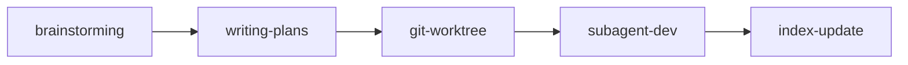

# 流水线定义（core/pipeline.md）

> Schema 定义：[`config/pipeline.schema.json`](../config/pipeline.schema.json)

## 功能级状态机

每个功能（`specs/<date+feature>/`）独立跟踪以下 7 个状态：

| 状态 | 对应 Step | 说明 |
|------|----------|------|
| `brainstorming` | Step 1 | 需求头脑风暴，探索 2-3 种实现方案 |
| `planning` | Step 2 | 按项目架构分层拆解 task |
| `approved` | — | 用户已确认计划，等待执行（检查点） |
| `executing` | Step 3-4 | 创建隔离分支，派发 subagent 编码 |
| `reviewing` | Step 4-5 | 代码审查（spec 合规 + 代码质量） |
| `synced` | Step 5 | 工程索引同步，功能完成 |
| `failed` | — | 任意阶段失败 |



## 5 步流水线

rss 框架的核心是 5 步流水线，定义了从需求到代码交付的完整执行流程。

```
brainstorming → writing-plans → git-worktree → subagent-dev → index-update
```



### 流水线阶段

| Step | 阶段 | 说明 | 输出 |
|------|------|------|------|
| 1 | brainstorming | 需求头脑风暴，探索 2-3 种实现方案 | `specs/<date+feature>/spec.md` |
| 2 | writing-plans | 按项目架构分层拆解 task | `specs/<date+feature>/plan.md` |
| 3 | git-worktree | 创建隔离分支 | feature 分支 |
| 4 | subagent-driven-development | Subagent 隔离派发 + 双审查 | 源码 + 测试报告 |
| 5 | index-update | 工程索引同步 | ENGINEERING-INDEX.md |

### 阶段串联规则

```
brainstorming 完成 → 等待用户确认 → writing-plans
writing-plans 完成 → 等待用户确认 → git-worktree
git-worktree 完成 → 触发 subagent-dev
subagent-dev 完成 → 触发 index-update
index-update 完成 → 通知可以提交
```

**严令禁止跳过任何步骤。每个步骤完成后必须显式触发下一步。**

### 状态横幅规范

每个阶段开始和结束时必须输出状态横幅，格式：

```
━━━━━━━━━━━━━━━━━━━━━━━━━━━━━━━━━━━━━━━━
 pipeline [<进度条>] Step N/5 — <阶段名称> (<skill名>)
 skill:   <skill名>
 功能:    <功能名>
 status:  ▶ 开始执行 | ✅ 完成 | ❌ 失败
 下一步:  → Step N+1: <下一阶段>
━━━━━━━━━━━━━━━━━━━━━━━━━━━━━━━━━━━━━━━━
```

进度条规则：5 格，已完成的步骤填 ■，未到达的填 □。当前步骤通过 Step N/5 标识，状态通过 status 行显示（▶ 进行中 / ✅ 完成 / ❌ 失败）。

### 前置条件检查

每个阶段开始前必须检查前置条件：

| 阶段 | 前置条件 |
|------|---------|
| brainstorming | 用户提供需求描述 |
| writing-plans | `spec.md` 存在且用户已确认 |
| git-worktree | `plan.md` 存在 |
| subagent-dev | `plan.md` 存在 + git worktree 已创建 |
| index-update | 所有测试通过（构建 + 静态检查 + 单元测试） |

前置条件未满足时，必须停止并提示用户。
