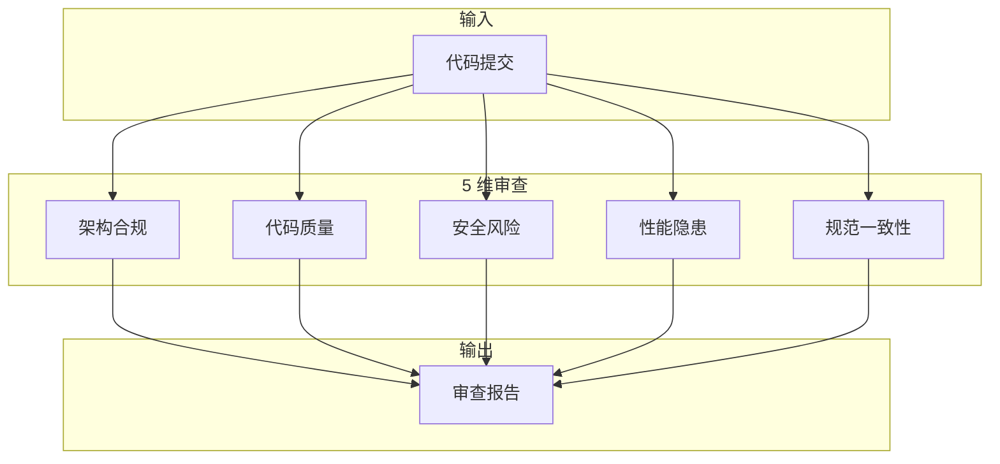

# 5 维审查框架（core/review-framework.md）

> Schema 定义：[`config/review.schema.json`](../config/review.schema.json)

## 审查维度

loom 使用 5 维审查替代通用 code review，覆盖架构、质量、安全、性能、规范。



### 维度定义

| # | 维度 | ID | 默认等级 | 说明 |
|---|------|----|---------|------|
| 1 | 架构合规 | `architecture` | BLOCKER | 分层是否正确，有无循环依赖 |
| 2 | 代码质量 | `code-quality` | BLOCKER | 编码规范、错误处理、日志格式 |
| 3 | 安全风险 | `security` | BLOCKER | SQL 注入、认证、输入验证、信息泄露 |
| 4 | 性能隐患 | `performance` | WARNING | N+1 查询、缺少分页、无缓存 |
| 5 | 规范一致性 | `conformance` | WARNING | 命名规范、响应格式、数据模型 |

### 严重等级

| 等级 | 含义 | 处理方式 |
|------|------|---------|
| BLOCKER | 必须修复，阻塞流水线 | 派回 implementer 修复 → 重新审查 |
| WARNING | 建议修复，不阻塞 | 标记待处理，用户确认后继续 |
| SUGGESTION | 优化建议 | 仅记录，不阻塞 |

### 审查检查项

#### 1. 架构合规（BLOCKER）

- 是否遵循项目架构分层（从 project-structure.md 读取）
- 是否存在跨层调用
- 是否存在循环依赖
- 新增模块是否遵循项目分层模式

#### 2. 代码质量（BLOCKER）

- 是否使用了项目禁止的调试函数
- SQL 是否参数化（防注入）
- 是否硬编码配置值（密码、密钥、URL）
- 是否捕获异常后静默吞掉
- 错误码是否使用项目统一格式

#### 3. 安全风险（BLOCKER）

- SQL 注入检查
- 认证/授权是否正确
- 输入验证是否充分
- 敏感信息是否泄露（日志、响应）
- CSRF/XSS 防护

#### 4. 性能隐患（WARNING）

- N+1 查询检查
- 分页查询是否使用框架分页组件
- 缓存策略是否合理
- 批量操作是否优化

#### 5. 规范一致性（WARNING）

- 命名是否符合项目规范
- 响应格式是否统一
- 数据模型是否正确嵌入
- 日志格式是否规范
- 注释是否必要且准确

### 输出格式

```markdown
## 审查报告

### BLOCKER (N)

- [ ] **[架构]** 跨层调用（接口层直接调用数据访问层）
- [ ] **[质量]** 使用了项目禁止的调试函数而非 logger
- [ ] **[安全]** SQL 拼接未使用参数化查询

### WARNING (N)

- [ ] **[性能]** 查询缺少分页，可能数据量过大
- [ ] **[规范]** 变量命名不符合 camelCase

### SUGGESTION (N)

- [ ] **[质量]** 函数过长，建议拆分
```

### 自定义维度

项目可在 `.loom/rules/review-dimensions.md` 中覆盖默认维度：

```markdown
# 自定义审查维度

在默认 5 维基础上追加：
6. 业务逻辑正确性 — BLOCKER — 验证业务规则是否正确实现
7. API 兼容性 — WARNING — 检查接口变更是否影响现有调用方
```

## 规格审查（Spec Review）

规格审查对照 `spec.md` 和当前 task 文件检查实现是否符合规格。

### 检查项

1. **接口定义检查** — 接口定义是否全部实现，参数、响应结构是否正确
2. **Task 完成度** — task 中定义的每个步骤是否都已完成
3. **范围检查** — 是否有多余的实现（超出 spec 范围）
4. **测试覆盖** — 测试用例是否覆盖 spec 中的关键场景

### 判定

| 结果 | 说明 | 处理 |
|------|------|------|
| `SPEC_COMPLIANT` | 实现符合规格 | 继续质量审查 |
| `SPEC_DEVIATION` (Critical) | 关键偏离 | 派回 implementer 修复 |
| `SPEC_DEVIATION` (Important) | 重要偏离 | 记录，继续质量审查 |
| `SPEC_DEVIATION` (Suggestion) | 建议偏离 | 记录，继续质量审查 |

## 合并审查判定（Combined Verdict）

合并审查将规格审查和质量审查合为一次审查（`combined-reviewer-prompt.md`）。

| 条件 | 结果 | 处理 |
|------|------|------|
| `SPEC_COMPLIANT` + `QUALITY_PASS` | **PASS** | 进入下一个 task |
| 任一 Critical 偏差 或 BLOCKER | **FAIL** | 派回 implementer 修复 |
| 仅有 Important/Suggestion/WARNING | **PASS** | 记录，继续 |

## Implementer 状态

| 状态 | 说明 | 处理 |
|------|------|------|
| `DONE` | 任务完成 | 进入审查 |
| `DONE_WITH_CONCERNS` | 完成但有疑虑 | 进入审查，审查员关注 concerns |
| `NEEDS_CONTEXT` | 需要更多信息 | 等待用户决策 |
| `BLOCKED` | 被阻塞 | 等待用户解决问题 |
