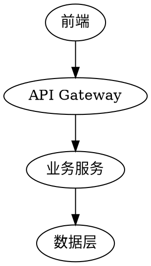

# 可视化伴侣指南

## 概述

可视化伴侣是一个基于浏览器的辅助工具，用于在 brainstorming 过程中展示模型、图表和视觉选项。

## 何时使用

**使用浏览器的场景（视觉内容）：**
- 模型、线框图、布局对比
- 架构图、流程图
- 并排视觉设计对比

**使用终端的场景（文本内容）：**
- 需求问题、概念选择
- 权衡列表、A/B/C/D 文本选项
- 范围决策

**重要：** 关于 UI 话题的问题不一定是视觉问题。"个性在这个上下文中意味着什么？" 是概念问题 — 使用终端。"哪个向导布局更有效？" 是视觉问题 — 使用浏览器。

## 启用步骤

1. 在 brainstorming 开始时询问用户：
   > "我们在做的事情中，有些内容如果能在浏览器中展示会更容易解释。我可以为你准备模型、图表、对比和其他可视化内容。这个功能还比较新，可能会消耗较多 token。你想试试吗？（需要打开本地 URL）"

2. 此询问**必须是独立消息**，不得与澄清问题、上下文摘要或其他内容合并。

3. 等待用户回应：
   - **同意**：读取本指南，使用浏览器展示视觉内容
   - **拒绝**：继续纯文本 brainstorming

4. 对每个问题决定使用浏览器还是终端。

## 视觉内容示例

### 架构图

### 布局对比
展示 2-3 种 UI 布局的 ASCII 艺术或简单 HTML。

### 数据模型
使用表格或简单的图形表示实体关系。

## Token 消耗提示

- 可视化内容会消耗更多 token
- 仅在真正需要视觉展示时使用
- 文本能说清楚的问题，优先使用终端
