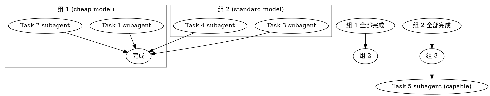
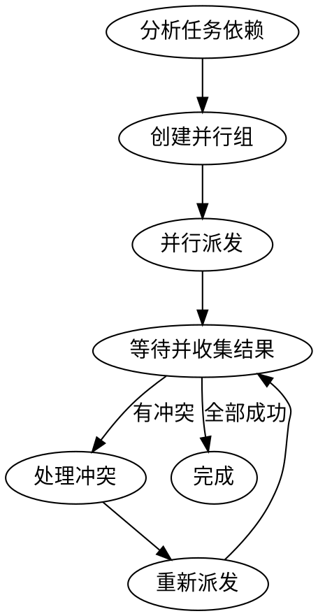

# 并行派发

## 适用场景

当多个任务之间没有依赖关系时，可以并行执行以提高效率。

**模型选择：** 并行任务通常使用便宜模型（cheap model），因为它们大多是机械实现任务。

## 执行流程

### Step1：分析任务依赖

1. 读取 `specs/<feature>/plan.md` 中的所有 task
2. 分析任务之间的依赖关系
3. 找出可并行的任务组

```markdown
## 依赖关系分析

| Task | 依赖 | 可并行组 | 复杂度 |
|------|------|---------|--------|
| Task 1 (Module A) | 无 | 组 1 | 简单 |
| Task 2 (Module B) | 无 | 组 1 | 简单 |
| Task 3 (Module C) | Task 1 | 组 2 | 中等 |
| Task 4 (Module D) | Task 2 | 组 2 | 中等 |
| Task 5 (Integration) | Task 3, 4 | 组 3 | 复杂 |
```

### Step2：创建并行组

将可并行的任务分组：

```
组 1: [Task 1, Task 2] → 并行执行（使用 cheap model）
组 2: [Task 3, Task 4] → 等组 1 完成后并行执行（使用 standard model）
组 3: [Task 5] → 等组 2 完成后执行（使用 capable model）
```

### Step3：并行派发

对同一组的任务，同时派发 subagent：

```
派发 Task 1 subagent (cheap) ──→ ┐
                                ├→ 全部完成后进入组 2
派发 Task 2 subagent (cheap) ──→ ┘
```

**并发工作流图：**



### Step4：等待并收集结果

1. 等待所有并行 subagent 完成
2. 收集每个 subagent 的输出
3. 验证所有任务成功
4. 如有失败，按顺序重新执行失败任务

### Step5：处理冲突

如果并行任务有潜在冲突（如修改同一文件）：

1. 按顺序执行冲突任务
2. 或将冲突任务拆分到不同组
3. 使用文件锁或队列机制（如适用）

## 并行派发模板

```
并行派发以下独立任务（使用 cheap model）：

## Task N: <任务名>
<完整 task 内容>

## Task M: <任务名>
<完整 task 内容>

## 约束
- 每个 subagent 独立工作，互不干扰
- 如发现与其他任务有冲突，立即报告
- 完成后输出创建/修改的文件列表
- 使用 cheap model（除非任务复杂）
```

## 约束

- 只有真正独立的任务才能并行
- 并行任务不能修改同一文件
- 必须等待所有并行 subagent 完成后才能继续
- 并行任务的结果需要合并验证
- 根据任务复杂度选择模型（cheap/standard/capable）

## 流程图


