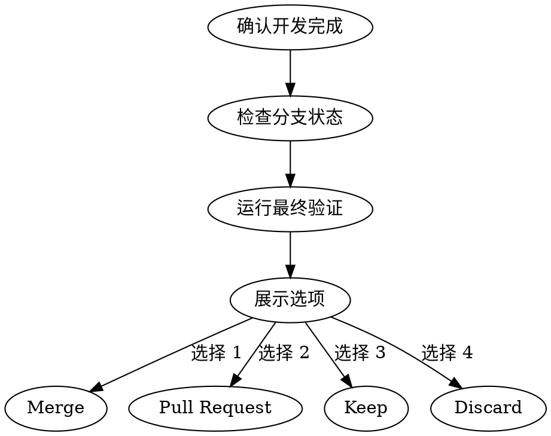

# 开发分支收尾

## 公告

开始时宣布："我正在使用 finishing-a-development-branch skill 来完成这项工作。"

## 执行流程

### Step 1：确认开发完成

1. 所有 task 已完成
2. 所有测试通过
3. 索引文件已更新
4. 无 BLOCKER
5. 测试报告已生成（来自 test-reporter）

### Step 2：检查分支状态

```bash
git status
git diff --stat
```

- [ ] 确认所有变更已暂存
- [ ] 确认没有意外的文件变更
- [ ] 确认不在主/主分支上

### Step 3：运行最终验证

读取 `.rss/constitution.md` 中的 BUILD_CMD、VET_CMD、TEST_CMD，依次执行。

- [ ] 编译通过
- [ ] vet 通过
- [ ] 测试全部通过

### Step 4：展示选项

向用户展示以下选项：

```
## 分支完成选项

**1. Merge（合并）** - 直接合并到主分支
**2. Pull Request** - 创建 PR 供审查
**3. Keep（保留）** - 保持分支，稍后继续
**4. Discard（丢弃）** - 丢弃所有变更

请选择？
```

### Step 5：执行用户选择

**如果选择 Merge：**
```bash
git checkout main
git merge --no-ff feature/<date>-<feature-name>
git push origin main
```

**如果选择 Pull Request：**
```bash
git push -u origin feature/<date>-<feature-name>
gh pr create --title "feat: <功能描述>" --body "$(cat <<'EOF'
## Summary
- 变更 1
- 变更 2

## Test plan
- [x] 编译通过
- [x] 测试通过
- [x] 代码审查通过
EOF
)"
```

**如果选择 Keep：**
- 保持当前状态
- 提醒用户稍后继续

**如果选择 Discard：**
```bash
git checkout main
git branch -D feature/<date>-<feature-name>
```

### Step 6：提交变更（如需要）

```bash
git add <specific-files>
git commit -m "$(cat <<'EOF'
feat: <功能描述>

- 变更 1
- 变更 2

Co-Authored-By: AI Assistant
EOF
)"
```

## 提交信息规范

```
<type>(<scope>): <subject>

<body>

Co-Authored-By: AI Assistant
```

**Type：**
- `feat`：新功能
- `fix`：修复
- `refactor`：重构
- `docs`：文档
- `test`：测试
- `chore`：杂项

## 约束

- 提交前必须运行完整验证
- 提交信息必须清晰描述变更内容
- 禁止提交敏感信息（密钥、密码等）
- 没有明确用户同意，永远不要在主/主分支上开始实现

## 流程图


