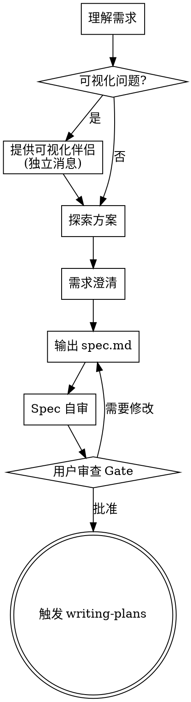

# 需求头脑风暴

## 触发条件

- 用户提出新需求："我想做 XX 功能"、"帮我设计 XX"
- 用户询问设计方案："怎么做 XX"、"有几种实现方式"
- 用户提供 PRD 文档

## 状态输出

执行开始时：

```
━━━━━━━━━━━━━━━━━━━━━━━━━━━━━━━━━━━━━━━━
 pipeline [■□□□□] Step 1/5 — 头脑风暴 (brainstorming)
 skill:   brainstorming
 功能:    <功能名>
 status:  ▶ 开始执行
━━━━━━━━━━━━━━━━━━━━━━━━━━━━━━━━━━━━━━━━
```

执行结束时：

```
━━━━━━━━━━━━━━━━━━━━━━━━━━━━━━━━━━━━━━━━
 pipeline [■□□□□] Step 1/5 — 头脑风暴 (brainstorming)
 status:  ✅ 完成 (N 种方案待选)
 下一步:  等待用户确认 → Step 2: writing-plans
━━━━━━━━━━━━━━━━━━━━━━━━━━━━━━━━━━━━━━━━
```

## 执行流程

### Step 1：理解需求

1. 读取 `.loom/memory/constitution.md`（宪章）了解项目约束
2. 读取 `.loom/rules/project-structure.md`（工程结构）了解技术栈和分层
3. 如果是修改类需求，先分析现有代码的实现方式和影响范围
4. 明确需求边界：做什么、不做什么

<HARD-GATE>
**禁止在实施前写任何代码、脚手架或执行实现操作。** 必须先展示设计并获得用户批准。适用于所有项目，无论看似多么简单。
</HARD-GATE>

### Step 2：探索 2-3 种实现方案

对每个方案包含：

- **方案名称**：简短描述
- **架构思路**：如何设计，涉及哪些模块
- **数据流**：请求 → 响应的完整数据流
- **trade-off**：优缺点分析
  - 复杂度
  - 性能
  - 可维护性
  - 扩展性
- **实现步骤**：高层次的步骤列表

**探索替代方案：**

- 提出 2-3 种不同方法及其权衡
- 以推荐方案开头并解释原因
- 范围评估：如果请求涉及多个独立子系统，立即标记。不要花时间细化需要先分解的项目。

### Step 3：可视化伴侣（可选）

**如果预计后续问题涉及可视化内容**（模型、布局、图表），可以询问用户是否使用可视化伴侣：

> "我们在做的事情中，有些内容如果能在浏览器中展示会更容易解释。我可以为你准备模型、图表、对比和其他可视化内容。这个功能还比较新，可能会消耗较多 token。你想试试吗？（需要打开本地 URL）"

**此询问必须是独立消息**，不得与澄清问题、上下文摘要或其他内容合并。等待用户回应后再继续。

**逐项决策：** 即使用户同意，也要**对每个问题**决定是否使用浏览器：

- **使用浏览器**：内容是可视化的 — 模型、线框图、布局对比、架构图
- **使用终端**：内容是文本的 — 需求问题、概念选择、权衡列表、A/B/C/D 文本选项、范围决策

如果用户同意，读取详细指南：
`skills/loom-brainstorming/REFERENCE/visual-companion.md`

### Step 4：需求澄清

将待决议项集中展示给用户，等用户一次性确认。不要逐个提问。

**提问原则：**

- **一次一个问题** — 不要用一个消息问多个问题
- **多选优先** — 尽可能使用选择题，也可以开放式
- **灵活应变** — 如果某个话题需要更多探索，拆分成多个问题

待决议项格式：

```markdown
## 待决议项

| #   | 问题           | 选项                              |
| --- | -------------- | --------------------------------- |
| 1   | 数据存储方式？ | A: 关系型数据库 / B: 文档型数据库 |
| 2   | 是否需要缓存？ | A: Redis 缓存 / B: 无缓存         |
```

### Step 5：输出 spec.md

用户确认方案后，输出结构化需求文档到 `specs/<date+feature>/spec.md`。

**文件名格式**：`<YYYY-MM-DD>+<功能名>`，如 `2026-04-26+user-management`

spec.md 格式（按项目类型调整——不是所有项目都有接口/数据模型/路由）：

```markdown
# <功能名> — 需求规格

## 1. 概述

**需求来源**：用户描述 / PRD 链接
**需求类型**：新增 / 修改
**选定方案**：方案 X — <简述>

## 2. 功能清单

| #   | 功能点 | 优先级 | 说明     |
| --- | ------ | ------ | -------- |
| 1   | xxx    | P0     | 核心功能 |
| 2   | xxx    | P1     | 次要功能 |

## 3. 接口/API 设计（如有）

### 3.1 <接口名>

- **调用方式**: POST /api/xxx/edit
- **描述**: ...
- **输入**:

| 参数 | 类型   | 必填 | 说明 |
| ---- | ------ | ---- | ---- |
| name | string | 是   | 名称 |

- **输出**:（遵循项目统一格式）

## 4. 数据设计（如有）

根据项目类型填写——可能是数据库表、数据结构、状态管理、文件格式等。

## 5. 业务规则

- 规则 1：...
- 规则 2：...

## 6. 异常/边界场景

| 场景     | 预期行为     |
| -------- | ------------ |
| 输入缺失 | 返回明确错误 |
| 权限不足 | 拒绝操作     |
```

### Step 6：Spec 自审

写入 spec 后，用新鲜的眼光检查：

1. **占位符扫描：** 有任何 "TBD"、"TODO"、未完成部分或模糊需求吗？修复它们。
2. **内部一致性：** 各部分有矛盾吗？架构描述与功能描述一致吗？
3. **范围检查：** 聚焦到单个实现计划了吗？需要分解吗？
4. **歧义检查：** 任何需求可能有两种解释吗？如果有，选一种并明确。

**内联修复问题**，无需重新审查 — 修复后继续。

### Step 7：用户审查 Gate

Spec 自审通过后，询问用户审查：

> "Spec 已写入并提交到 `<path>`。请在继续编写实现计划之前审查 spec，并告诉我是否需要做任何更改。"

等待用户回应。如果请求更改，进行修改并重新运行 spec 自审。只有用户批准后才能继续。

## 约束

- 必须读取宪章后才能设计方案
- 每个方案必须有 trade-off 分析
- 禁止模糊描述："大概""可能""差不多"
- 数值必须有单位："2秒内""100条/页"
- 接口/API 设计必须遵循项目约定
- **YAGNI 原则**：无情删除所有设计中的不必要功能
- **增量验证**：分段展示设计，获得批准后再继续

## 关键原则

- **一次一个问题** - 不要用一个消息问多个问题
- **多选优先** - 尽可能使用选择题
- **YAGNI 无情** - 从所有设计中删除不必要的功能
- **探索替代方案** - 在决定前总是提出 2-3 种方法
- **增量验证** - 展示设计，获得批准后再继续
- **灵活应变** - 当某些事情不合理时，回溯澄清

## 流程图



## 完成条件与下一步

spec.md 保存并自审完毕后，必须同时更新 `specs/<date+feature>/progress.md`，**等待用户确认方案**。

用户确认后，**必须立即触发 writing-plans**（writing-plans skill）。
