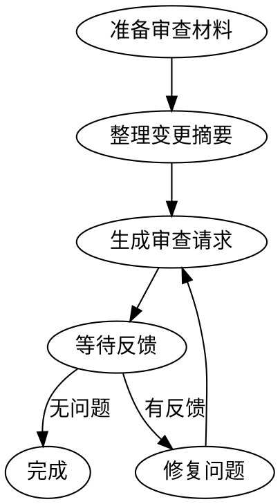

# 请求代码审查

## 预审查清单

在请求审查前，确保：

- [ ] 所有变更已提交
- [ ] 编译通过（BUILD_CMD）
- [ ] 静态分析通过（VET_CMD）
- [ ] 所有测试通过（TEST_CMD）
- [ ] 代码符合项目编码红线
- [ ] ENGINEERING-INDEX.md 已更新

## 执行流程

### Step1：准备审查材料

1. 确认所有变更已完成
2. 运行验证确保代码质量（读取宪章中的 BUILD_CMD、VET_CMD、TEST_CMD 并执行）

### Step2：整理变更摘要

```bash
git diff --stat
git log --oneline -10
```

### Step3：生成审查请求

```markdown
## 代码审查请求

**功能：** <feature-name>
**分支：** feature/<date>-<feature-name>
**变更范围：**

### 变更摘要

| 文件 | 变更类型 | 说明 |
|------|---------|------|
| path/to/file1 | 新增 | XxxService 实现 |
| path/to/file2 | 修改 | 新增方法 |

### 重点关注

1. 架构设计：xxx
2. 安全性：xxx
3. 性能：xxx

### 自测情况

- [x] 编译通过
- [x] 测试通过
- [x] 代码自查
```

### Step4：等待反馈

- 监听审查反馈
- 及时回复审查意见
- 按要求修复问题

## 审查模板

```
# 代码审查请求

## 概述
- **功能**：<feature-name>
- **分支**：feature/<date>-<feature-name>
- **相关 Spec**：specs/<date+feature>/spec.md

## 变更统计
<git diff --stat 输出>

## 主要变更
1. <变更说明 1>
2. <变更说明 2>

## 测试计划
- [x] 单元测试通过
- [x] 集成测试通过
- [x] 手动验证完成

## 审查重点
- [ ] 架构合规性
- [ ] 代码质量
- [ ] 安全性检查
- [ ] 性能影响
```

## 约束

- 审查请求必须包含完整的变更摘要
- 必须标注重点关注项
- 必须提供自测情况

## 流程图


