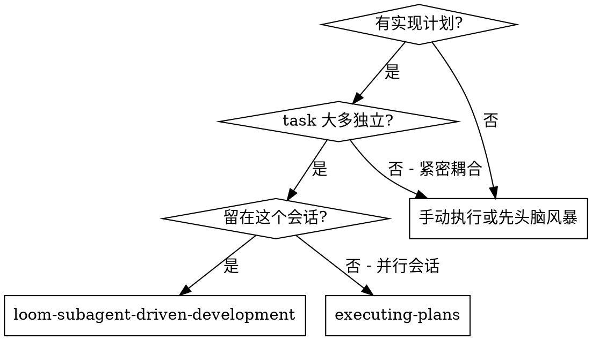

# Subagent 编码执行

## 触发条件

- `specs/<date+feature>/plan.md` 已存在（摘要 + Task 概览）
- git worktree 已创建
- 用户确认 plan 后自动触发

## 状态输出

- 开始：`▶ pipeline [■■■■□□] Step 4/6 — 编码执行 (subagent-dev) | 功能: <功能名> | N 个 task`
- 完成：`✅ pipeline [■■■■□□] Step 4/6 — 编码执行 | 完成 (N/N task PASS, 测试报告已生成) | → Step 5: verification`

## 公告

开始时宣布："我正在使用 Subagent-Driven Development 执行这个计划。"

## 核心机制

**每个 task 派发独立 subagent，上下文互不继承：**

```
首次派发（首次实现模式）：
  Task N → implementer(完整task + spec + subagent-context) → reviewer → PASS/FAIL

修复派发（修复模式，增量上下文）：
  reviewer FAIL → 提取修复指令 → implementer(修复指令 + subagent-context) → reviewer
  test-reporter FAIL → 提取修复指令 → implementer(修复指令 + subagent-context) → test-reporter
  verification FAIL → 提取修复指令 → implementer(修复指令 + subagent-context) → verification
```

**修复模式 vs 首次实现模式的上下文差异：**

| 上下文项 | 首次实现模式 | 修复模式 |
|---------|:----------:|:------:|
| tasks/TN.md 当前 task | ✅ | ❌ |
| 修复指令 | ❌ | ✅ |
| spec.md 全文 | ✅ | ❌ |
| subagent-context.md | ✅ | ✅ |
| reviewer/test-reporter 输出 | ❌ | ❌（修复指令已包含定位信息） |

修复模式只传递：修复指令（问题 + 文件 + 位置 + 方向）+ subagent-context.md（编码红线等约束），不重新传递完整 task 定义和 spec 全文。

**为什么使用 subagent：** 你将任务委托给具有隔离上下文的专门 agent。通过精确构建他们的指令和上下文，确保他们保持专注并成功完成任务。他们永远不应该继承你会话的上下文或历史 — 你精确构建他们需要什么。这也保留了你自己的上下文用于协调工作。

**核心原则：** 每个 task 一个 fresh subagent + 合并审查（spec 合规 + 代码质量）= 高质量、快速迭代

**回路原则：** 审查或测试失败时，派发**修复模式** implementer（增量上下文），而非全量重新派发。修复模式只传递问题定位和修复方向，不重新传递完整 task 上下文。

**持续执行：** 不要在 task 之间暂停与你的合作伙伴交流。在没有停止的情况下执行计划中的所有 task。停止的唯一原因是：你无法解决的 BLOCKED 状态、真正阻碍进度的歧义，或所有 task 完成。"我应该继续吗？"提示和进度摘要浪费他们的时间 — 他们要求你执行计划，所以执行它。

## 何时使用



**vs. Executing Plans（并行会话）：**

- 同一会话（无上下文切换）
- 每个 task 一个 fresh subagent（无上下文污染）
- 每个 task 后合并审查：spec 合规 + 代码质量一次完成
- 更快迭代（task 之间没有人工环节）

## 模型选择

<!-- 模型选择策略详见 writing-plans SKILL.md -->
机械实现任务→便宜模型，集成判断→标准模型，架构审查→最强模型。
- 触及1-2个文件且有完整规范 → 便宜模型
- 触及多个文件且有集成问题 → 标准模型
- 需要设计判断或广泛代码库理解 → 最强模型

## 处理 Implementer 状态

Implementer subagent 报告四种状态之一。适当处理每一种：

**DONE：** 继续合并审查。

**DONE_WITH_CONCERNS：** 实现者完成了工作但标记了疑虑。在继续审查之前阅读疑虑。如果疑虑是关于正确性或范围，在审查前解决它们。如果它们是观察（例如，"这个文件越来越大"），注意它们并继续审查。

**NEEDS_CONTEXT：** 实现者需要未提供的信息。提供缺失的上下文并重新派发。

**BLOCKED：** 实现者无法完成任务。评估 blocker：

1. 如果是上下文问题，提供更多上下文并使用相同模型重新派发
2. 如果任务需要更多推理，使用更强大的模型重新派发
3. 如果任务太大，把它分解成更小的部分
4. 如果计划本身是错误的，上报给人类

**永远**不要忽略升级或强制相同模型在没有任何更改的情况下重试。如果实现者说它被卡住了，需要改变一些东西。

## 执行流程

```
读取plan → 对每个task循环:
  派发implementer(首次实现模式) → 实现者问问题？
    ├→ 是 → 回答并提供上下文 → 重新派发(首次实现模式)
    ├→ BLOCKED → 评估阻塞原因，提供上下文或分解任务
    └→ 否 → implementer实现/测试(持久化)/自检
      → 派发combined reviewer → 审查通过？
        ├→ 否 → 提取修复指令 → 派发implementer(修复模式) → 重新审查（循环）
        └→ 是 → 标记task完成 → 还有更多task？
              ├→ 是 → 下一个task
              └→ 否 → 派发test-reporter →
                          1.编写集成测试(持久化)
                          2.运行全量回归测试
                          3.对照spec验证
                          4.输出测试报告
                            ├→ 全部PASS → verification
                            └→ 有FAIL → 提取修复指令 → 派发implementer(修复模式)
                                            → 修复后重新派发test-reporter（循环）
```

## 派发前准备

### 准备：读取 plan

从 `specs/<date+feature>/plan.md` 读取 Task 概览（摘要和依赖关系），从 `specs/<date+feature>/tasks/TN.md` 读取每个 task 的详细内容。创建任务追踪列表。

### 准备：读取项目约束（派发时传入精简上下文）

每个 subagent 必须注入精简上下文模板：`.loom/templates/subagent-context.md`, 同时传入：
- `specs/<date+feature>/spec.md` — 需求规格
- `specs/<date+feature>/plan.md` — Task 概览（编排器用）
- `specs/<date+feature>/tasks/TN.md` — 当前 task 详细内容（implementer/reviewer 用）

## 每个 Task 的执行循环（必须执行）

### Step 1：派发 implementer subagent

**首次派发（首次实现模式）：**

**输入上下文：**

- `specs/<date+feature>/spec.md` 中相关章节
- `specs/<date+feature>/tasks/TN.md`（当前 task 详细内容）
- `.loom/templates/subagent-context.md`（精简项目约束）

**implementer 的指令模板：**
参见 `implementer-prompt.md`，模式设为"首次实现模式"

**修复派发（修复模式，增量上下文）：**

当 reviewer 或 test-reporter 判定为 FAIL 时，从其输出的"修复指令"部分提取修复项，派发修复模式 implementer：

**输入上下文：**

- 修复指令（从 reviewer/test-reporter 输出中提取的结构化修复指令）
- `.loom/templates/subagent-context.md`（精简项目约束）

**不再传递：** 当前 task 详细内容（TN.md）、spec.md 全文（修复指令中已包含足够的定位信息）

**implementer 的指令模板：**
参见 `implementer-prompt.md`，模式设为"修复模式"

### Step 2：派发 combined reviewer subagent

**审查模式**：合并审查（spec 合规 + 代码质量一次完成），参见 `combined-reviewer-prompt.md`

**输入上下文：**

- implementer 的输出（创建/修改的文件列表 + 代码）
- `specs/<date+feature>/spec.md`（完整需求）
- `specs/<date+feature>/tasks/TN.md`（当前 task 详细内容）
- `.loom/templates/subagent-context.md`（精简项目约束）
- git diff（仅变更部分）

**判定规则：**

- PASS → 进入下一个 task
- FAIL → 从 reviewer 输出中提取修复指令，派发 implementer（修复模式），修复后重新审查

## 全部 task 完成后

### Step 3：派发 test-reporter subagent（集成测试 + 回归测试, 必须执行）

全部 task 通过审查后，必须派发一个 test-reporter subagent 执行以下工作：

1. **编写集成测试**：为 spec.md 中定义的跨模块交互场景编写集成测试，测试文件持久化到项目标准测试目录
2. **运行全量回归测试**：执行项目完整测试套件，区分新增代码引起的失败和预先存在的失败
3. **对照 spec 验证**：逐一验证 spec.md 中定义的每个接口
4. **输出测试报告**：保存到 `specs/<date+feature>/test-report.md`

**不要在 test-reporter 派发前自行运行编译和测试**，这些由 test-reporter 负责执行。

**test-reporter 的指令模板：**
参见 `test-reporter-prompt.md`

**判定规则：**

- **全部 PASS** → 通过，触发 verification-before-completion skill
- **集成测试 FAIL** → 不通过，从 test-reporter 输出中提取修复指令，派发 implementer（修复模式），修复后重新派发 test-reporter
- **回归测试有新增代码引起的失败** → 不通过，从 test-reporter 输出中提取修复指令，派发 implementer（修复模式），修复后重新派发 test-reporter
- **回归测试仅有预先存在的失败** → 标记 WARN，不阻断流水线
- **存在 WARN** → 记录警告，等用户选择跳过或修复

## 最终验证

**在 test-reporter 之前，先执行全量编译和测试。全部通过后方可派发 test-reporter 生成报告。同时更新 `specs/<date+feature>/progress.md`。**

## progress.md 更新

**开始执行时**：更新 `specs/<date+feature>/progress.md`，将 Step 4 状态设为 `▶ 进行中`，**开始时间填写当前时间（HH:mm 格式，如 14:30）**，备注列填写总 task 数（如 `task 0/8`）；在 Skill 调用记录中追加一行，时间列填写当前时间。

**每个 task 完成时**：更新备注列的 task 进度（如 `task 3/8`）。

**全部 task 完成时**：将 Step 4 状态更新为 `✅ 完成`，**完成时间填写当前时间（HH:mm 格式）**；在 Skill 调用记录中更新对应行结果为 `✅ 已完成`，时间列填写完成时的时间。

**关键：时间必须填入实际的 HH:mm 数值（如 14:30），禁止填入字面量 "HH:mm"。**

## 红线与关键规则

**永远不要：**

- 禁止在没有明确用户同意的情况下在主/主分支上开始实现
- 禁止在 spec 未获用户批准、plan 未确认前开始任何代码实现
- 禁止跳过审查（spec 合规 + 代码质量）
- 禁止在有未修复问题的情况下继续
- 禁止默认并行派发多个实现 subagent（如需并行，必须使用 `loom-dispatching-parallel-agents skill`且确认任务间无依赖和文件冲突）
- 禁止跳过场景设置上下文（subagent 需要理解 task 适合的位置）
- 禁止忽略 subagent 问题（在让他们继续之前回答）
- 禁止接受 spec 合规的"足够接近"
- 禁止跳过审查循环（reviewer 发现问题 = 实现者修复 = 再次审查）
- 禁止让实现者自检替代实际审查
- 任一审查有未解决问题时禁止移动到下一个 task
- 禁止将测试文件作为临时验证后删除
- 禁止跳过集成测试（test-reporter 必须编写集成测试）
- 禁止跳过回归测试（test-reporter 必须运行全量回归测试）

**关键规则：**

1. subagent 互不继承上下文 — 每个 subagent 是全新会话，必须完整传入所需上下文
2. BLOCKER 阻断 — 任一审查有 BLOCKER 或 Critical 偏差则不进入下一个 task
3. 三类测试要求 — implementer 必须编写并运行单元测试（持久化到项目标准测试目录），test-reporter 必须编写集成测试并运行全量回归测试
4. 测试报告必须生成 — 全部 task 完成后必须派发 test-reporter
5. 停止条件 — 遇到 plan 不清晰、重复修复无效、spec 有歧义时立即停止并询问用户
6. **修复派发用增量上下文** — reviewer/test-reporter/verification 失败时，提取修复指令派发 implementer（修复模式），禁止全量重新派发首次实现模式

**如果 subagent 问问题：** 清晰完整地回答，提供额外上下文，不催促实现。

**如果 reviewer 发现问题：** 从 reviewer 输出中提取修复指令 → 派发 implementer（修复模式）→ 再次审查 → 直到批准，禁止跳过重新审查。

**如果 subagent 失败 task：** 使用修复指令派发修复 subagent，不手动修复（上下文污染）。

## 集成

**必需工作流技能：**

- **loom-using-git-worktrees** - 确保隔离工作空间
- **loom-writing-plans** - 创建此技能执行的计划
- **loom-requesting-code-review** - reviewer subagent 的代码审查模板
- **loom-finishing-a-development-branch** - 所有 task 后完成开发

**Subagent 应该使用：**

- **loom-test-driven-development** - Subagent 遵循每个 task 的 TDD

## 完成条件与下一步

所有步骤完成后，必须同时更新 `specs/<date+feature>/progress.md`（按上述 progress.md 更新规则填写完成时间）。验证通过后，触发 verification-before-completion（loom-verification-before-completion skill）。
