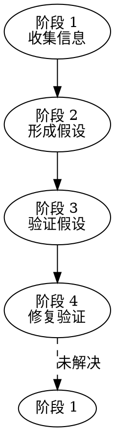
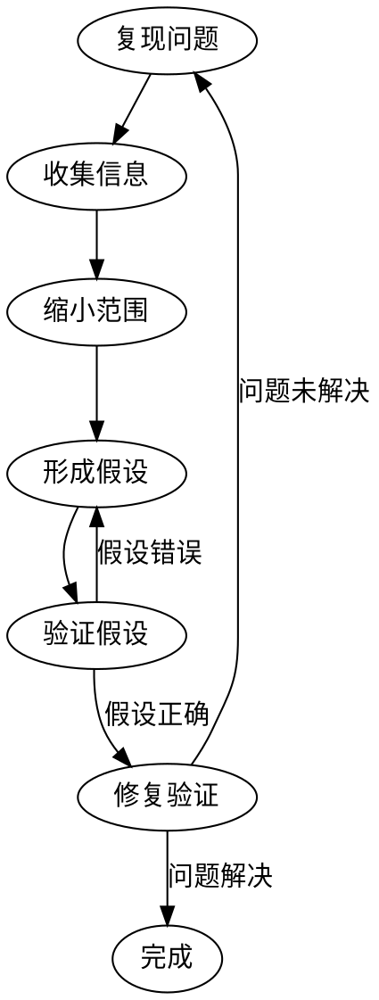

# 系统化调试

## 调试原则

**先找根因，再修问题。** 系统化方法首次修复率约 95%，随机猜测仅 40%。

1. **先复现**：稳定复现问题才能有效调试
2. **收集信息**：日志、错误信息、堆栈追踪
3. **缩小范围**：从大到小，逐步定位
4. **形成假设**：基于信息形成可能的原因假设
5. **验证假设**：最小化改动验证假设
6. **修复验证**：修复后验证问题是否解决

## 绝对规则

**Phase 1 完成前不许提出解决方案。** 三次修复失败 → 重新审视架构，不是再试一次补丁。

多组件系统：在每个边界插桩，定位数据流在哪里断了。

## 4 阶段根因分析流程



### 阶段 1：收集信息

**错误信息**
- 控制台输出
- 日志文件
- 堆栈追踪

**上下文信息**
- 触发条件
- 输入数据
- 系统状态

**对比分析**
- 最近的代码变更
- 配置变更
- 环境变更

### 阶段 2：形成假设

基于收集的信息，列出可能的原因：

```markdown
## 假设列表

| # | 假设 | 依据 | 验证方法 |
|---|------|------|---------|
| 1 | 数据库连接超时 | 日志显示连接错误 | 检查连接池配置 |
| 2 | 参数解析错误 | 请求参数格式异常 | 检查绑定标签 |
```

### 阶段 3：验证假设

逐一验证假设，每次只验证一个：

1. 选择最可能的假设
2. 做最小化改动验证
3. 如果假设正确 → 进入修复
4. 如果假设错误 → 验证下一个假设

### 阶段 4：修复验证

1. 实施修复
2. 编写回归测试
3. 运行全量测试
4. 确认问题解决

## 执行流程

### Step 1：复现问题

1. 确认问题的复现步骤
2. 记录环境信息（操作系统、版本、配置）
3. 确认问题是否可稳定复现

### Step 2：收集信息

**2.1 错误信息**
- 控制台输出
- 日志文件
- 堆栈追踪

**2.2 上下文信息**
- 触发条件
- 输入数据
- 系统状态

**2.3 对比分析**
- 最近的代码变更
- 配置变更
- 环境变更

### Step 3：缩小范围

1. **二分法**：如果不确定哪个变更导致问题，使用 git bisect
2. **日志定位**：在关键位置添加日志，追踪数据流
3. **单元测试**：编写测试覆盖问题场景
4. **断点调试**：使用调试器单步执行
5. **条件等待**：使用 condition-based-waiting 技术等待异步操作完成
6. **纵深防御**：使用 defense-in-depth 技术建立多层防护

### Step 4：形成假设

基于收集的信息，列出可能的原因：

```markdown
## 假设列表

| # | 假设 | 依据 | 验证方法 |
|---|------|------|---------|
| 1 | 数据库连接超时 | 日志显示连接错误 | 检查连接池配置 |
| 2 | 参数解析错误 | 请求参数格式异常 | 检查绑定标签 |
```

### Step 5：验证假设

逐一验证假设，每次只验证一个：

1. 选择最可能的假设
2. 做最小化改动验证
3. 如果假设正确 → 进入修复
4. 如果假设错误 → 验证下一个假设

### Step 6：修复和验证

1. 实施修复
2. 编写回归测试
3. 运行全量测试
4. 确认问题解决

## 常见问题模式

### 数据库相关

- 连接池耗尽 → 调整连接池配置
- 慢查询 → 添加索引、优化 SQL
- 死锁 → 检查事务顺序
- 数据不一致 → 检查事务隔离级别

### 网络相关

- 连接超时 → 检查网络、调整超时
- DNS 解析失败 → 检查 DNS 配置
- SSL 证书问题 → 检查证书有效性

### 内存相关

- 内存泄漏 → 检查资源释放
- OOM → 检查数据量、内存配置
- GC 压力 → 检查对象分配

### 并发相关

- 数据竞争 → 添加锁、使用原子操作
- 死锁 → 检查锁顺序
- 竞态条件 → 添加同步机制

## 调试技术

### 条件等待（Condition-Based Waiting）

当调试异步问题时，不要使用固定 sleep，而是：
1. 设置明确的完成条件
2. 轮询检查条件是否满足
3. 设置合理的超时时间
4. 超时时提供诊断信息

### 纵深防御（Defense in Depth）

建立多层防护来验证假设：
1. 输入验证层：检查输入合法性
2. 业务逻辑层：验证业务规则
3. 数据/状态层：检查数据完整性
4. 输出层：验证输出格式

## 调试工具

| 工具 | 用途 |
|------|------|
| 日志 | 追踪执行流程和数据 |
| 调试器 | 单步执行、查看变量 |
| 性能分析 | 定位性能瓶颈 |
| 内存分析 | 定位内存问题 |
| 网络抓包 | 分析网络请求 |
| git bisect | 二分查找引入问题的提交 |

## 警告信号

出现以下想法意味着你在走捷径，立即回到 Phase 1：
- "先快速修一下" / "quick fix for now"
- "大概是 X，修一下" / "probably X, let me fix that"
- "这个简单" / "this is simple"
- "就试一个东西" / "just try this one thing"
- 三次修复失败还在猜

**所有这些意味着：停止猜测，回到根因分析。**

## 输出格式

```markdown
## 调试报告

**问题描述：** xxx
**影响范围：** xxx
**复现步骤：**
1. xxx
2. xxx

### 根因分析
- **直接原因：** xxx
- **根本原因：** xxx

### 修复方案
- **修改文件：** path/to/file
- **修改内容：** xxx
- **回归测试：** 已添加测试覆盖

### 预防措施
- 添加监控告警
- 添加单元测试覆盖
```

## 流程图


