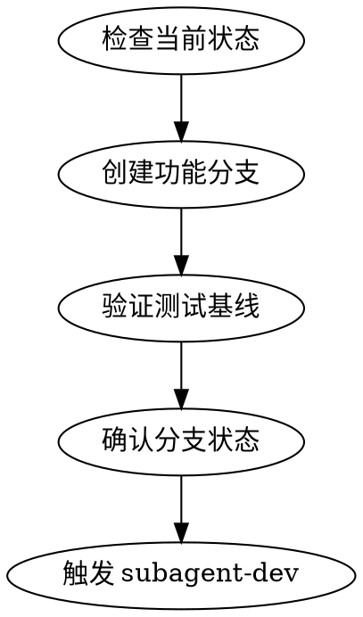

# Git 工作树隔离

## 核心原则

**检测现有隔离 → 原生工具优先 → git worktree 作为兜底。**

## Step 0：检测是否已在隔离环境

在创建任何东西之前，先检查当前是否已在 worktree 中：

```bash
# 检测 worktree
git rev-parse --git-dir
git rev-parse --git-common-dir

# 如果 GIT_DIR != GIT_COMMON，已在 worktree 中
# 检测 submodule
git rev-parse --show-superproject-working-tree
```

**如果已在隔离环境中：** 跳过创建，直接使用当前环境。

## 公告

开始时宣布："我正在使用 using-git-worktrees skill 创建隔离工作空间。"

## 执行流程

### Step 1：检查当前状态

```bash
git status
```

- [ ] 确认当前在正确的分支（通常为主分支）
- [ ] 确认没有未提交的变更
- [ ] 确认有实现计划（`specs/<date+feature>/plan.md`）

### Step 2：创建隔离工作空间

**优先使用平台原生工具：**

- 优先使用 AI 工具的工作空间管理功能
- 其他平台：检查是否有 `WorktreeCreate` 类工具
- 兜底：手动 `git worktree add`

**目录安全：** 创建前确认 worktree 目录在 `.gitignore` 中，防止意外提交。

分支命名规范：

```
feature/<date>-<feature-name>
```

示例：

- `feature/2026-04-26-passport-list`
- `feature/2026-04-26-user-auth`

```bash
# 兜底方案（原生工具不可用时）
git worktree add .worktree/<date>-<feature-name> -b feature/<date>-<feature-name>
```

### Step 3：安装依赖并验证基线

自动检测项目类型并安装依赖，然后运行测试确保干净起点。

```bash
<读取 constitution.md 中的 TEST_CMD 并执行>
```

- [ ] 依赖安装成功
- [ ] 所有测试通过
- [ ] 没有失败的测试

**如果基线测试失败：** 停止，报告问题，等用户确认是否继续。

### Step 4：确认分支状态

```bash
git branch --show-current
```

确认分支已创建并切换成功。

## 状态输出

```
━━━━━━━━━━━━━━━━━━━━━━━━━━━━━━━━━━━━━━━
 pipeline [■■■□□□] Step 3/6 — git-worktree
 功能:    <feature-name>
 status:  ✅ 完成
 分支:    feature/<date>-<feature-name>
 下一步:  → Step 4: subagent-dev
━━━━━━━━━━━━━━━━━━━━━━━━━━━━━━━━━━━━━━━
```

## 分支命名规则

- 功能分支：`feature/<date>-<name>`
- 修复分支：`fix/<date>-<name>`
- 重构分支：`refactor/<date>-<name>`
- 文档分支：`docs/<date>-<name>`

## 约束

- 禁止在主分支直接开发
- 每个功能使用独立分支
- 分支名使用小写字母和连字符
- 分支名应简洁明了
- 没有明确用户同意，永远不要在主/主分支上开始实现
- **禁止创建嵌套 worktree**（worktree 中再建 worktree）
- **只清理自己创建的 worktree**（验证路径在 superpower 管理目录下）
- 目录创建前必须确认 `.gitignore` 规则

## 流程图



## 完成条件与下一步

分支创建并验证测试基线后，必须同时更新 `specs/<date+feature>/progress.md`，**触发 subagent-driven-development（loom-subagent-driven-development skill）** 进行编码执行。
