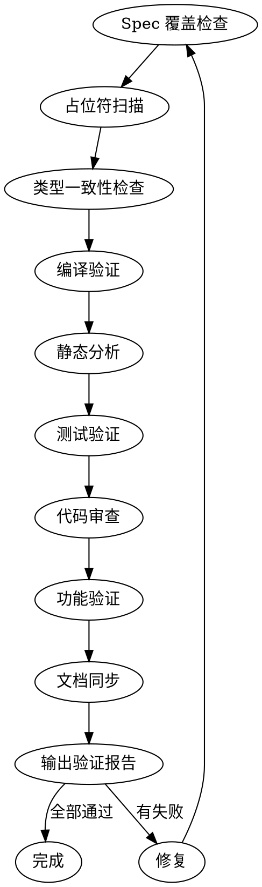

# 完成前验证

## 状态输出

执行开始时：

```
━━━━━━━━━━━━━━━━━━━━━━━━━━━━━━━━━━━━━━━━
 pipeline [■■■■■□] Step 5/6 — 完成前验证 (verification)
 skill:   verification-before-completion
 status:  ▶ 开始执行
━━━━━━━━━━━━━━━━━━━━━━━━━━━━━━━━━━━━━━━━
```

执行结束时：

```
━━━━━━━━━━━━━━━━━━━━━━━━━━━━━━━━━━━━━━━━
 pipeline [■■■■■□] Step 5/6 — 完成前验证 (verification)
 status:  ✅ 完成
 下一步:  → Step 6: index-update
━━━━━━━━━━━━━━━━━━━━━━━━━━━━━━━━━━━━━━━━
```

## 铁律

**没有证据就不能声称通过。** 违反字面就是违反精神。

**"没有新鲜验证证据就不许声称完成。"** 如果当前消息中没有执行过验证命令，就不许断言某项通过。

## 门禁函数

做出任何状态声明前：

1. **识别**：哪个命令能证明你的声明
2. **运行**：完整执行该命令
3. **读取**：完整输出，包括退出码和失败数
4. **验证**：输出是否真正确认了你的断言
5. **然后**才做出声明并附带证据

跳过任何一步 = 不诚实。

## Red Flag

以下措辞意味着未验证就声称：

- "应该通过了" / "probably passes"
- "似乎没问题" / "seems fine"
- "我觉得可以" / "I think it works"
- 表达满意在验证之前
- 信任 agent 报告而无独立确认

**发现Red Flag？** 立即停止，运行实际命令，读取输出，然后才声称。

## 验证清单

在宣布任务完成前，必须执行以下检查：

### 1. Spec 覆盖检查

- [ ] 浏览 spec 中的每个部分/需求
- [ ] 可以指向实现它的 task
- [ ] 列出任何缺口

### 2. 占位符扫描

- [ ] 搜索计划中的Red Flag — "TBD"、"TODO"、"implement later"
- [ ] 修复它们

### 3. 类型一致性

- [ ] 后面 task 中使用的类型、方法签名和属性名与早期 task 中定义的匹配
- [ ] 函数在 Task 3 中叫 `clearLayers()` 但在 Task 7 中叫 `clearFullLayers()` 是 bug

### 4. 编译验证

读取 `.loom/memory/constitution.md` 中的 `BUILD_CMD` 并执行。

- [ ] 编译通过，无错误
- [ ] 无编译警告

### 5. 静态分析

读取 `.loom/memory/constitution.md` 中的 `VET_CMD` 并执行。

- [ ] vet 通过，无警告

### 6. 测试验证

读取 `.loom/memory/constitution.md` 中的 `TEST_CMD` 并执行。

- [ ] 所有测试通过
- [ ] 无跳过的测试（除非有正当理由）

### 7. 代码审查

- [ ] 遵守编码红线（读取 constitution.md，逐一检查）
- [ ] 架构分层职责清晰，不跨层写逻辑
- [ ] 无硬编码配置
- [ ] 无不安全的字符串拼接（SQL/命令/HTML 等）
- [ ] 错误处理正确
- [ ] 日志格式规范

### 8. 功能验证

- [ ] spec.md 中的所有功能已实现
- [ ] 功能点可正常使用
- [ ] 输出/响应符合预期
- [ ] 错误处理正确

### 9. 文档同步

- [ ] ENGINEERING-INDEX.md 已更新
- [ ] MEMORY.md 已更新（如需要）
- [ ] 进度追踪已更新

## 执行流程

### Step 1：Spec 覆盖检查

浏览 spec 中的每个部分/需求。可以指向实现它的 task。列出任何缺口。

### Step 2：占位符扫描

搜索计划中的Red Flag — 任何 "TBD"、"TODO"、"implement later"、"fill in details"、"Similar to Task N"。修复它们。

### Step 3：类型一致性检查

后面 task 中使用的类型、方法签名和属性名是否与早期 task 中定义的匹配？函数在 Task 3 中叫 `clearLayers()` 但在 Task 7 中叫 `clearFullLayers()` 是 bug。

### Step 4：运行编译和测试

读取 `.loom/memory/constitution.md` 中的 BUILD_CMD、VET_CMD、TEST_CMD，依次执行。

### Step 5：检查代码质量

对照编码红线逐一检查。

### Step 6：对照 spec 验证

读取 `specs/<date+feature>/spec.md`，确认所有功能已实现。

### Step 7：确认文档同步

检查索引文件是否已更新。

### Step 8：输出验证报告

保存到 `specs/<date+feature>/verify-report.md`。

```markdown
## 完成前验证报告

**功能：** xxx
**验证时间：** YYYY-MM-DD HH:mm

### 检查结果

| 检查项     | 状态 | 说明     |
| ---------- | ---- | -------- |
| Spec 覆盖  | ✅   | 全部覆盖 |
| 占位符扫描 | ✅   | 无占位符 |
| 类型一致性 | ✅   | 类型匹配 |
| BUILD_CMD  | ✅   | 编译通过 |
| VET_CMD    | ✅   | 无警告   |
| TEST_CMD   | ✅   | 全部通过 |
| 编码红线   | ✅   | 无违规   |
| 功能完整性 | ✅   | 全部实现 |
| 文档同步   | ✅   | 已更新   |

**结论：** ✅ 可以提交
```

## 约束

- 所有检查必须通过才能提交
- 任何一项失败都需要先修复
- 不允许跳过检查

## 完成条件与下一步

**验证通过后：** 触发 index-update（loom-index-update skill）

**验证未通过：** 修复问题后重新执行验证

## 流程图


