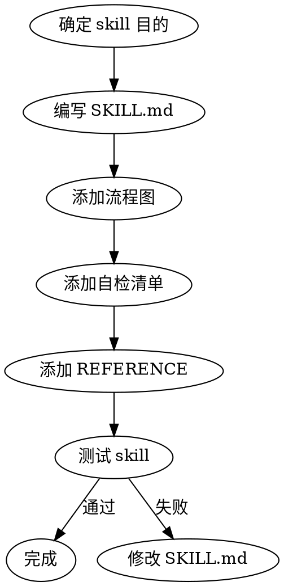

# 编写新 Skill

## Skill 文件结构

```
skills/
  <skill-name>/
    SKILL.md          # 必需：skill 主文件
    REFERENCE/        # 可选：参考文件
      *.md
```

## SKILL.md 格式

```markdown
---
name: loom-<skill-name>
description: >
  简短描述。说明何时使用此 skill。
  Use when: <触发条件描述>.
  Trigger keywords: <关键词列表>.
---

# <Skill 标题>

## 触发条件

- 用户说 xxx 时触发
- 在 xxx 流程中自动触发

## 状态输出（如适用）
执行开始时：
```
━━━━━━━━━━━━━━━━━━━━━━━━━━━━━━━━━━━━━━━
 pipeline [进度条] Step N/5 — 阶段名 (skill名)
  skill:   skill名
  status:  ▶ 开始执行
━━━━━━━━━━━━━━━━━━━━━━━━━━━━━━━━━━━━━━━
```

## 执行流程

### Step 1: ...
### Step 2: ...

## 约束

- 规则 1
- 规则 2

## 完成条件与下一步

完成后触发下一个 skill。
```

## Frontmatter 字段

| 字段 | 必需 | 说明 |
|------|------|------|
| name | 是 | skill 名称，必须与目录名一致 |
| description | 是 | 简短描述，用于 Skill 工具选择 |
| trigger | 否 | 触发条件说明 |

## 编写原则

1. **单一职责**：一个 skill 做一件事
2. **清晰触发**：明确什么条件下触发
3. **完整流程**：包含执行所需的全部步骤
4. **可中断**：支持在任何步骤暂停等待用户输入
5. **可链式**：支持与其他 skill 串联
6. **方法论深度**：包含流程图、自检清单、反模式、常见误区

## 状态横幅规范

如果 skill 是流水线的一部分，需要输出状态横幅：

```
━━━━━━━━━━━━━━━━━━━━━━━━━━━━━━━━━━━━━━━
 pipeline [■■■□□□] Step N/M — 阶段名 (skill名)
  skill:   <skill名>
  功能:    <功能名>
  status:  ▶ 开始执行 | ✅ 完成 | ❌ 失败
  下一步:  → Step N+1: <下一阶段>
━━━━━━━━━━━━━━━━━━━━━━━━━━━━━━━━━━━━━━━
```

## Reference 文件

如果 skill 需要大量参考信息，放在 REFERENCE/ 目录：

- 保持 SKILL.md 精简
- REFERENCE/ 包含详细检查清单、模板、示例
- 在 SKILL.md 中引用 REFERENCE 文件

**常用 REFERENCE 文件：**
- `visual-companion.md` - 可视化伴侣详细指南
- `testing-anti-patterns.md` - 测试反模式
- `common-excuses.md` - 常见借口对照表
- `design-checklist.md` - 设计自检清单

## 测试新方法

### 编写 Skill 时遵循 TDD

1. **红**：写一个失败的测试（这个 skill 应该做什么？）
2. **绿**：实现最小功能让测试通过
3. **重构**：优化 skill 结构和内容

### 测试新 Skill

### 核心：TDD for Skills

**"没看到 agent 在没有这个 skill 时失败过，就不知道 skill 是否教对了东西。"**

方法论：红 → 绿 → 重构

1. **红**：不用 skill 时跑 agent，观察它在哪里合理化/跳过/犯错
2. **绿**：写最少的 skill 内容让 agent 不再犯那个错
3. **重构**：通过重测发现漏洞，修补

**测试流程：**
1. 创建 skill 目录和 SKILL.md
2. 先不用 skill 跑一遍，记录失败模式（红）
3. 使用 Skill 工具调用测试
4. 验证触发条件是否正确
5. 验证 agent 是否不再犯之前的错（绿）
6. 检查是否包含方法论元素（流程图、清单、反模式）
7. 重测找漏洞，修补（重构）

### 常见 Anti-Pattern

创建 skill 时避免：
- 一个 skill 做多件事（违反单一职责）
- 触发条件太宽或太窄（太宽则误触发，太窄则永远不触发）
- 缺少流程图（难以理解执行顺序）
- 缺少自检清单（无法验证输出质量）
- 步骤描述模糊（"处理错误"而非"检查返回码，若为 404 则重试"）
- 没有完成条件（不知道何时算完成）
- 不与其他 skill 串联（孤立存在，不知何时触发下一步）

## 流程图


