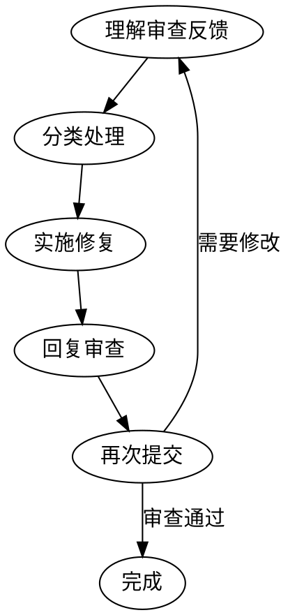

# 接受代码审查

## 核心原则

**技术严谨 > 社交舒适。** 验证后再行动，不搞表演性同意。

审查反馈是需要技术评估的输入，不是情感表演的机会。

## 禁止的回复

**永远不要：**
- "你说得对！"（表演性同意）
- "好主意！"（无意义附和）
- "我马上改！"（未验证就行动）

**应该：**
- 重述技术要求
- 提出澄清问题
- 用技术推理 push back
- 直接行动（行动 > 语言）

**正确的反馈回复：**
```
✅ "已修复。[简述改动]"
✅ "好发现 - [具体问题]。已修复于 [位置]。"
✅ [直接修复，通过代码展示]

❌ "你说得对！"
❌ "好主意！"
```

## 反馈来源区分

### 来自 human partner（可信）
- 理解后可直接实施
- 范围不清时仍需确认
- 不搞表演性附和
- 直接行动或技术确认

### 来自外部审查者
**实施前必须检查：**
1. 对当前代码库技术正确吗？
2. 会破坏现有功能吗？
3. 当前实现有什么原因？
4. 所有平台/版本都能工作吗？
5. 审查者理解完整上下文吗？

**如果建议有问题：用技术推理 push back。**

**如果无法验证：明确说明"需要 [X] 才能验证，应该 [调查/询问/继续]？"**

## YAGNI 检查

审查者建议"properly implement"时：
- 先 grep 代码库看是否真的在用
- 未使用：建议删除（YAGNI）
- 在用：再实施

## 何时 Push Back

- 建议破坏现有功能
- 审查者缺乏完整上下文
- 违反 YAGNI（未使用的功能）
- 对当前技术栈技术不正确
- 遗留/兼容性原因
- 与 human partner 的架构决策冲突

**Push back 方式：**
- 用技术推理，不搞防御性
- 问具体问题
- 引用可工作的测试/代码
- 涉及架构时请示 human partner

## 不清楚的反馈

```
如果任何项不清楚：
  停止 - 不要实施任何东西
  先询问不清楚的项

原因：各项可能相关。部分理解 = 错误实施。
```

**示例：**
```
human partner: "修复 1-6"
你理解 1,2,3,6。4,5 不清楚。

❌ 错误：先实施 1,2,3,6，之后再问 4,5
✅ 正确："理解了 1,2,3,6。实施前需要确认 4 和 5。"
```

## 执行流程

### Step1：理解审查反馈

1. 逐一阅读审查意见
2. 分类反馈：
   - **必须修复**：BLOCKER
   - **建议修复**：SUGGESTION
   - **讨论**：需要进一步讨论

### Step2：分类处理

**BLOCKER（必须修复）：**
1. 理解问题
2. 实施修复
3. 验证修复

**SUGGESTION（建议修复）：**
1. 评估建议的合理性
2. 决定采纳或拒绝
3. 如果拒绝，提供理由

**讨论项：**
1. 与审查者沟通
2. 达成共识
3. 按共识处理

### Step3：实施修复

1. 按审查意见修改代码
2. 运行测试确保修复正确
3. 提交修复

### Step4：回复审查

对每个审查意见回复：

```markdown
## 审查反馈处理

### 已修复

| # | 意见 | 修复内容 |
|---|------|---------|
| 1 | 职责跨层 | 已移到正确层级 |
| 2 | 缺少参数校验 | 已添加 |

### 已讨论

| # | 意见 | 决定 | 理由 |
|---|------|------|------|
| 1 | 建议添加缓存 | 暂不添加 | 当前访问量低 |
```

### Step5：再次提交

```bash
git add <modified-files>
git commit -m "fix: 根据审查反馈修复 xxx"
git push
```

## 响应模板

```
# 审查反馈响应

## 已修复的问题

### BLOCKER 问题
| # | 意见 | 修复内容 | 验证结果 |
|---|------|---------|----------|
| 1 | <意见> | <修复> | ✅ 通过 |

## 已采纳的建议

| # | 建议 | 实施内容 |
|---|------|---------|
| 1 | <建议> | <实施> |

## 已拒绝的建议

| # | 建议 | 拒绝理由 |
|---|------|----------|
| 1 | <建议> | <理由> |

## 验证结果
- [x] 编译通过
- [x] 测试通过
- [x] 代码自查
```

## 约束

- BLOCKER 必须全部修复
- SUGGESTION 必须明确回复采纳或拒绝
- 拒绝建议时必须提供理由
- 修复后必须重新运行测试

## 流程图


