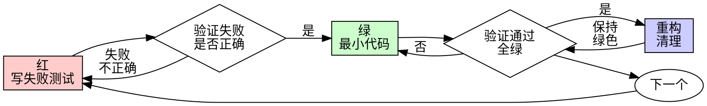

# 测试驱动开发（TDD）

## 核心循环

```
红（Red）→ 绿（Green）→ 重构（Refactor）
```

1. **红**：先写一个失败的测试
2. **绿**：写最少的代码让测试通过
3. **重构**：优化代码结构，保持测试通过

## 铁律

```
没有失败的测试在先 → 不写生产代码
```

**先写了代码？** 删除它。从头开始。

**没有例外：**
- 不要保留作为"参考"
- 不要"改编"它
- 不要看它
- 删除意味着删除

从测试开始重新实现。句号。

## 何时使用

**总是：**
- 新功能
- Bug 修复
- 重构
- 行为变更

**例外（询问你的合作伙伴）：**
- 一次性原型
- 生成的代码
- 配置文件

想着"就这一次跳过 TDD"？停下。那是在合理化。

## 执行流程

### Step 1：理解需求

1. 读取 `specs/<feature>/spec.md` 获取需求
2. 读取 `specs/<feature>/plan.md` 获取实现计划
3. 明确当前 task 的测试范围

### Step 2：红（写失败测试）

1. 为当前功能编写测试用例
2. 测试应验证 spec.md 中定义的预期行为
3. **运行测试，确认测试失败**

读取宪章 TEST_CMD 并执行单文件测试。

**确认：**
- 测试失败（不是错误）
- 失败信息是预期的
- 因为缺少功能而失败（不是拼写错误）

**测试通过？** 你在测试现有行为。修复测试。

**测试报错？** 修复错误，重新运行直到正确失败。

**好的测试示例：**
```language
test('重试失败操作 3 次', async () => {
  let attempts = 0;
  const operation = () => {
    attempts++;
    if (attempts < 3) throw new Error('fail');
    return 'success';
  };

  const result = await retryOperation(operation);

  expect(result).toBe('success');
  expect(attempts).toBe(3);
});
```
清晰名称，测试真实行为，一件事

**坏的测试示例：**
```language
test('retry works', async () => {
  const mock = jest.fn()
    .mockRejectedValueOnce(new Error())
    .mockRejectedValueOnce(new Error())
    .mockResolvedValueOnce('success');
  await retryOperation(mock);
  expect(mock).toHaveBeenCalledTimes(3);
});
```
模糊名称，测试 mock 不是代码

### Step 3：绿（写最少代码）

1. 编写最少的代码让测试通过
2. 不要过度设计
3. **运行测试，确认测试通过**

读取宪章 TEST_CMD 并执行单文件测试。

**好的实现示例：**
```language
async function retryOperation<T>(fn: () => Promise<T>): Promise<T> {
  for (let i = 0; i < 3; i++) {
    try {
      return await fn();
    } catch (e) {
      if (i === 2) throw e;
    }
  }
  throw new Error('unreachable');
}
```
刚好够通过

**坏的实现示例：**
```language
async function retryOperation<T>(
  fn: () => Promise<T>,
  options?: {
    maxRetries?: number;
    backoff?: 'linear' | 'exponential';
    onRetry?: (attempt: number) => void;
  }
): Promise<T> {
  // YAGNI
}
```
过度工程

不要添加功能、重构其他代码，或"改进"超出测试范围的内容。

### Step 4：重构（优化代码）

**仅在变绿后：**
1. 在测试保护下优化代码
2. 消除重复、改善命名
3. **运行测试，确认测试仍然通过**

读取宪章 BUILD_CMD、VET_CMD、TEST_CMD 并执行。

保持测试绿色。不要添加行为。

### Step 5：重复

对下一个功能点重复以上循环。

## 测试编写规范

### 测试文件命名

按项目语言的测试文件命名约定。

### 测试结构

```
// 1. 准备（Arrange）
// 2. 执行（Act）
// 3. 断言（Assert）
```

按项目语言的测试框架编写具体测试代码。

### 测试覆盖

- 正常流程：验证正确行为
- 异常流程：验证错误处理
- 边界条件：验证边界值处理

## 好测试的标准

| 质量 | 好 | 坏 |
|---------|------|-----|
| **极简** | 一件事。"and"在名称中？拆分它。 | `test('validates email and domain and whitespace')` |
| **清晰** | 名称描述行为 | `test('test1')` |
| **展示意图** | 演示期望的 API | 模糊代码应该做什么 |

## 为什么顺序很重要

**"我会在之后写测试来验证它是否工作"**

测试后写的代码立即通过。立即通过证明不了什么：
- 可能测试错误的东西
- 可能测试实现，不是行为
- 可能错过你忘记的边界情况
- 你从没看到它抓住 bug

测试优先迫使你看到测试失败，证明它确实测试了什么。

**"我已经手动测试了所有边界情况"**

手动测试是临时的。你以为测试了一切，但：
- 没有记录你测试了什么
- 代码更改时无法重新运行
- 压力下容易忘记情况
- "我试的时候能用" ≠ 全面

自动化测试是系统的。它们每次都以相同的方式运行。

**"删除 X 小时的工作是浪费"**

沉没成本谬误。时间已经消失了。你现在的选择：
- 删除并从 TDD 重新开始（多 X 小时，高信心）
- 保留它并在之后添加测试（30 分钟，低信心，可能有 bug）

"浪费"是保留你无法信任的代码。没有真实测试的可用代码是技术债务。

## 常见合理化借口

| 借口 | 现实 |
|--------|---------|
| "太简单了不需要测试" | 简单的代码也会崩溃。测试需要 30 秒。 |
| "我之后会测试" | 测试立即通过证明不了什么。 |
| "测试后达到相同目标" | 测试后 = "这是做什么？" 测试前 = "这应该做什么？" |
| "已经手动测试了" | 临时 ≠ 系统。没有记录，无法重新运行。 |
| "删除 X 小时是浪费" | 沉没成本谬误。保留未验证的代码是技术债务。 |
| "保留作为参考，先写测试" | 你会改编它。那是测试后。删除意味着删除。 |
| "需要先探索" | 可以。扔掉探索，从 TDD 开始。 |
| "测试很难 = 设计不清晰" | 听测试。难测试 = 难用。 |
| "TDD 会拖慢我" | TDD 比调试快。务实 = 测试优先。 |
| "手动测试更快" | 手动不能证明边界情况。每次更改你都会重新测试。 |
| "现有代码没有测试" | 你在改进它。为现有代码添加测试。 |

## 红旗 — 停止并重新开始

- 先写代码后写测试
- 测试在实现之后
- 测试立即通过
- 无法解释测试为什么失败
- 测试"之后"添加
- 合理化"就这一次"
- "我已经手动测试了"
- "测试后达到相同目的"
- "这是关于精神不是仪式"
- "保留作为参考"或"改编现有代码"
- "已经花了 X 小时，删除是浪费"
- "TDD 是教条，我很务实"
- "这不同因为..."

**所有这些意味着：删除代码。从 TDD 重新开始。**

## Bug 修复示例

**Bug：** 接受空邮件

**红**
```language
test('拒绝空邮件', async () => {
  const result = await submitForm({ email: '' });
  expect(result.error).toBe('Email required');
});
```

**验证红**
```bash
$ npm test
FAIL: expected 'Email required', got undefined
```

**绿**
```language
function submitForm(data: FormData) {
  if (!data.email?.trim()) {
    return { error: 'Email required' };
  }
  // ...
}
```

**验证绿**
```bash
$ npm test
PASS
```

**重构**
如果需要，为多个字段提取验证。

## 验证清单

工作完成前：

- [ ] 每个新函数/方法都有测试
- [ ] 观看每个测试在实现之前失败
- [ ] 每个测试因预期原因失败（缺少功能，不是拼写错误）
- [ ] 写了最少的代码让每个测试通过
- [ ] 所有测试通过
- [ ] 输出干净（无错误、警告）
- [ ] 测试使用真实代码（仅不可避免时用 mock）
- [ ] 覆盖边界情况和错误

无法勾选所有框？你跳过了 TDD。重新开始。

## 卡住了怎么办

| 问题 | 解决方案 |
|---------|----------|
| 不知道怎么测试 | 写下期望的 API。先写断言。询问你的合作伙伴。 |
| 测试太复杂 | 设计太复杂。简化接口。 |
| 必须 mock 一切 | 代码耦合太紧。使用依赖注入。 |
| 测试设置巨大 | 提取辅助函数。仍然复杂？简化设计。 |

## 调试集成

发现 bug？写重现它的失败测试。遵循 TDD 循环。测试证明修复并防止回归。

永远不要在没有测试的情况下修复 bug。

## 测试反模式

添加 mock 或测试工具时，阅读 REFERENCE/testing-anti-patterns.md 避免常见陷阱：
- 测试 mock 行为而不是真实行为
- 向生产类添加仅测试的方法
- 在不理解依赖关系的情况下 mock

## 最终规则

```
生产代码 → 测试存在且先失败
否则 → 不是 TDD
```

没有你的合作伙伴的许可，没有例外。

## 流程图


