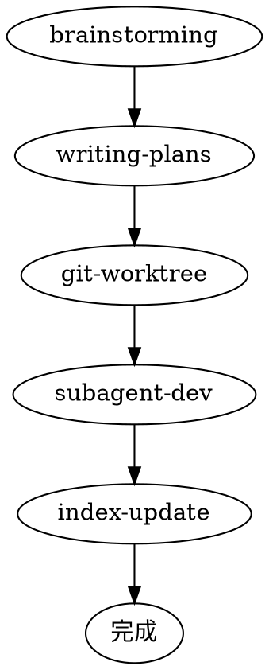

# Using loom — AI 工程化框架

loom 是一个基于 superpowers 增强的 AI 工程化框架，提供 5 步流水线、项目宪章、5 维审查、进度追踪等能力。

## 核心流水线

```
brainstorming → writing-plans → git-worktree → subagent-dev → index-update
```

### 流水线阶段

| Step | 阶段                        | 说明                              | 输出                           |
| ---- | --------------------------- | --------------------------------- | ------------------------------ |
| 1    | brainstorming               | 需求头脑风暴，探索 2-3 种实现方案 | `specs/<date+feature>/spec.md` |
| 2    | writing-plans               | 按分层拆解 task                   | `specs/<date+feature>/plan.md` |
| 3    | git-worktree                | 创建隔离分支                      | feature 分支                   |
| 4    | subagent-driven-development | Subagent 隔离派发 + 双审查        | 源码 + 测试报告                |
| 5    | index-update                | 工程索引同步                      | ENGINEERING-INDEX.md           |

### 阶段串联规则

- brainstorming 完成 → 等待用户确认 → writing-plans
- writing-plans 完成 → 等待用户确认 → git-worktree
- git-worktree 完成 → 触发 subagent-dev
- subagent-dev 完成 → 触发 index-update
- index-update 完成 → 通知可以提交

**严令禁止跳过任何步骤。**

## Skills 系统

loom 继承了 superpowers 的 skills 系统，并进行了融合增强。

### Skills 清单

**核心流水线 Skills（融合增强）：**

| Skill                       | 说明                 | 输出                           | 增强点                               |
| --------------------------- | -------------------- | ------------------------------ | ------------------------------------ |
| brainstorming               | 需求头脑风暴         | `specs/<date+feature>/spec.md` | +可视化伴侣、设计自检、用户审查 Gate |
| writing-plans               | 分层拆解 task        | `specs/<date+feature>/plan.md` | +模型选择、类型一致性检查            |
| git-worktree                | 创建隔离分支         | feature 分支                   | +测试基线验证                        |
| subagent-driven-development | Subagent 派发 + 审查 | 源码 + 测试报告                | +独立模板文件、4种状态处理           |
| index-update                | 工程索引同步         | ENGINEERING-INDEX.md           | loom 新增                            |

**辅助 Skills（loom 新增）：**

| Skill        | 说明                               |
| ------------ | ---------------------------------- |
| init-project | 项目初始化（扫描 + 生成宪章/结构） |
| using-loom   | loom 框架使用指南（本 skill）      |

**通用 Skills（继承 superpowers 并融合）：**

| Skill                          | 说明              | 融合点                             |
| ------------------------------ | ----------------- | ---------------------------------- |
| test-driven-development        | TDD 测试驱动开发  | +流程图、好/坏示例、常见借口表     |
| systematic-debugging           | 系统化调试        | +4阶段流程图、条件等待、纵深防御   |
| verification-before-completion | 完成前验证        | +Spec覆盖检查、类型一致性          |
| requesting-code-review         | 请求代码审查      | +预审查清单、审查模板              |
| receiving-code-review          | 接受代码审查      | +响应模板、流程图                  |
| dispatching-parallel-agents    | 并行 agent 派发   | +模型选择、并发工作流图            |
| writing-skills                 | 编写自定义 skills | +方法论深度、流程图                |
| finishing-a-development-branch | 分支完成流程      | +选项展示（Merge/PR/Keep/Discard） |

**已删除的 Skills：**

- `executing-plans` — 已被 subagent-driven-development 替代

### Skills 触发方式

**自动触发：**

- 当满足触发条件时，skill 会自动激活
- 例如：用户说"我想做 XX 功能" → 触发 brainstorming

**手动调用：**

- 使用 Skill 工具：`Skill("brainstorming")`
- 使用斜杠命令：`/loom-brainstorm`、`/loom-write-plan`、`/loom-execute-plan`

## 项目规则

项目规则存储在 `.loom/memory/constitution.md`（宪章）和 `.loom/rules/project-structure.md`（工程约束）中。

首次使用请运行 `/loom-init-project` 自动生成这些文件。

## 进度追踪

每个功能开发维护 `specs/<date+feature>/progress.md`，可视化流水线状态。

## 状态横幅

每个阶段输出状态横幅：

```
━━━━━━━━━━━━━━━━━━━━━━━━━━━━━━━━━━━━━━━
 pipeline [<进度条>] Step N/5 — <阶段名称>
 功能:    <功能名>
 status:  ▶ 开始执行 | ✅ 完成 | ❌ 失败
 下一步:  → Step N+1: <下一阶段>
━━━━━━━━━━━━━━━━━━━━━━━━━━━━━━━━━━━━━━━
```

## 5 维审查

loom 使用 5 维审查替代通用 code review：

1. **架构合规** — BLOCKER — 分层是否正确
2. **代码质量** — BLOCKER — 编码规范、错误处理
3. **安全风险** — BLOCKER — SQL 注入、认证、输入验证
4. **性能隐患** — WARNING — N+1 查询、缓存
5. **规范一致性** — WARNING — 命名、响应格式

## 与 superpowers 的关系

loom 继承 superpowers 的插件基础设施，融合增强核心 skills：

- **增强**：brainstorming、writing-plans、subagent-driven-development、test-driven-development 等
- **新增**：index-update、init-project、using-loom
- **继承**：所有通用 skills，并融合 superpowers 的优点（流程图、自检清单、反模式等）

## 常见问题

### Q: loom 和 superpowers 有什么区别？

A: loom 基于 superpowers 增强，增加了中文支持、项目集成（宪章、工程结构）、5 维审查、流水线状态横幅等特性，并融合了 superpowers 的方法论深度。

### Q: 可以跳过某个步骤吗？

A: **不可以。** 流水线每个步骤都有明确目的，跳过会导致质量问题。

### Q: 如何知道当前在哪个阶段？

A: 查看状态横幅，或读取 `specs/<date+feature>/progress.md`。

### Q: subagent 失败了怎么办？

A: 查看失败状态（BLOCKED/NEEDS_CONTEXT），根据情况提供更多信息、更换模型或分解任务。

## 流程图


